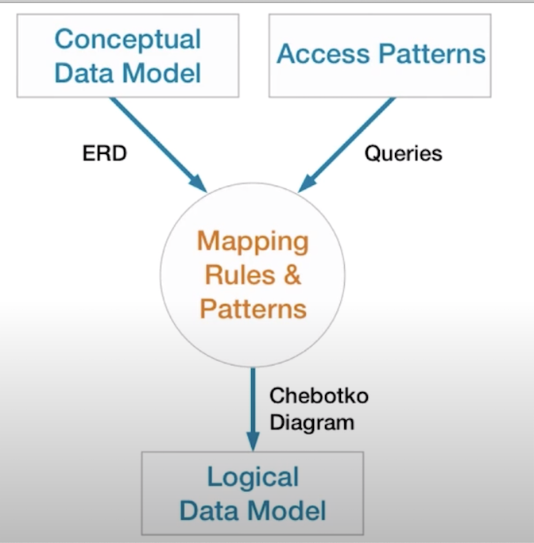
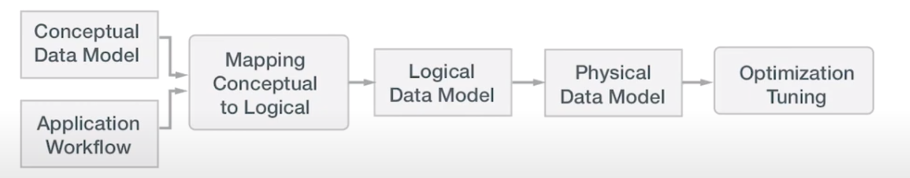
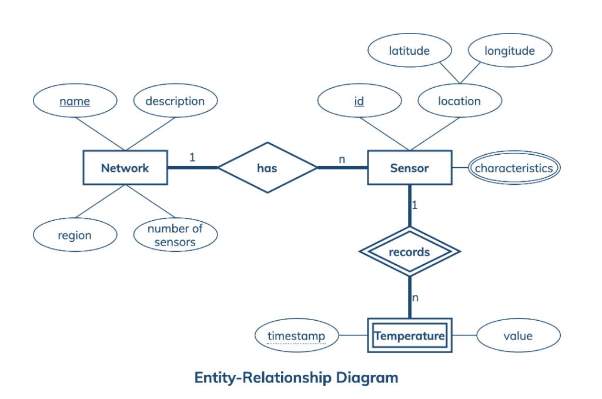
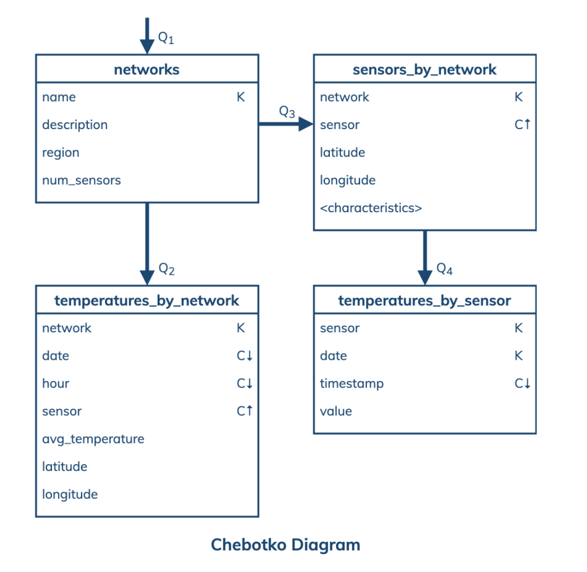
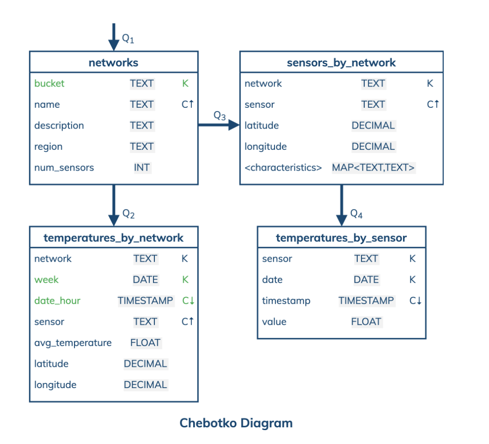
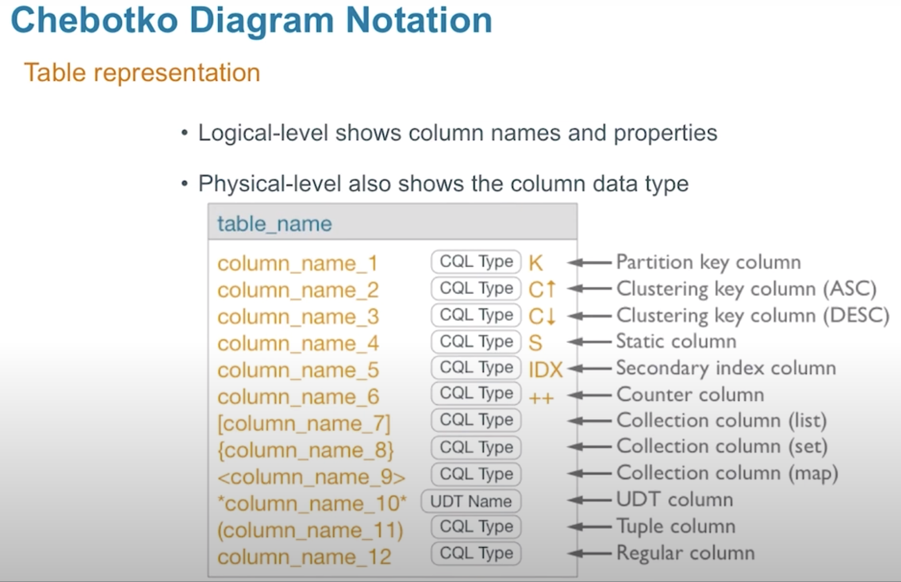

# Cassandra Data Modeling

### Design flow

### Conceptual Data Model
  - Abstract view of your domain
  - Technology independent
	- Not specific to any database
	- Attributes
		- key
		- composite attributes
		- multi-valued attributes
	- ER model
		- entity types
		- relation types
		- attribute types
	- cardinality
	- weak entity types

  

### Application workflow & access patterns
- An application workflow is designed with the goal of understanding data access patterns for a data-driven application
- Its visual representation consists of application tasks, dependencies among tasks, and data access patterns
- Ideally, each data access pattern should specify what attributes to search for, search on, order by, or do aggregation on.

### Logical Data Model
- A logical data model results from a conceptual data model by organizing data into Cassandra-specific data structures based on data access patterns identified by an application workflow.
- can be represented by chebotko diagrams
- mapping rules
	- entities and relationships -> define table + attributes
	- equality search attributes -> uniquely identify row (pk)
	- inequality search attributes -> clustering columns
	- ordering attributes -> specify order of clustering column
	- key attributes -> ?

### Physical Data Model
- logical model + cql datatype
- can be represented by chebotko diagrams

### Chebotko notation

### References
[Data modeling Examples](https://www.datastax.com/learn/data-modeling-by-example)
